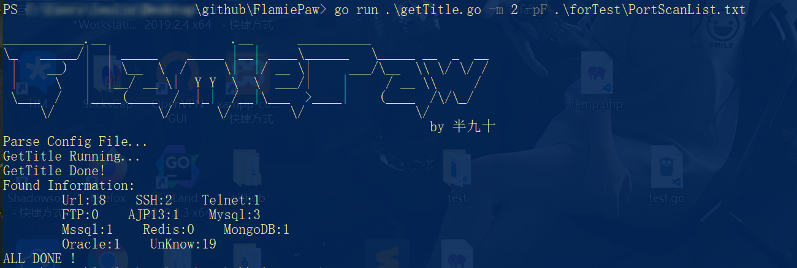
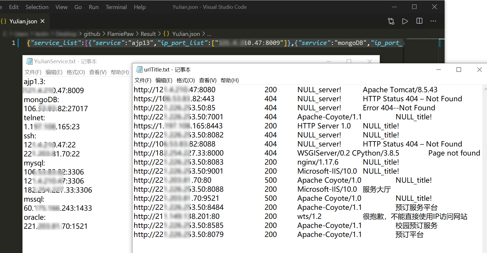

# FlamiePaw

### introduction：

 一个旨在渗透初期批量处理资产端扫结果的工具

目前实现了处理从nmap或御剑端口扫描器导出结果，初步信息筛检，探测开放web服务并获取title，将资产发送至crawlergo爬虫可配合xray进行web漏扫等功能。


### Usage:
```
Command:
  -m int
        mode choice:
        	1:parse from url list,-uF Needed;
        	2:parse from port scan file,-pF or -xF Needed
  -uF string
        url file name
  -pF string
        yujian port scan file
  -xF string
        nmap output xmlFileName
  -crawler bool
        run crawler at last
```
### Example:

##### 目前支持分捡的协议：

SSH、FTP、MySQL、MSSQL、Telnet、ajp13、Redis、MongoDB、Oracle

##### (1）处理url，探测web title：
```
	go run getTitle.go -m 1 -uF url1.txt
```
##### (2）处理端扫导出文件

##### web探测结果保存在.\Result\urlTitle.txt中，其他端口服务结果文本格式和json格式保存在.\Result\下

1. ###### 处理御剑导出结果：

```
	go run getTitle.go -m 2 -pF PortScanList1.txt
```
御剑扫描结果导出格式如下：


######     2.处理Nmap导出XML文件结果：
```
	go run getTitle.go -m 2 -xF output.xml
```

**输出样例：**



##### 输出文件：




### ToDo：
- [x] 文本处理区别不同系统换行符
- [x] 添加访问代理
- [x] 链接端口扫描结果处理的工具实现整合
- [ ] 添加分拣出service的未授权访问扫描


