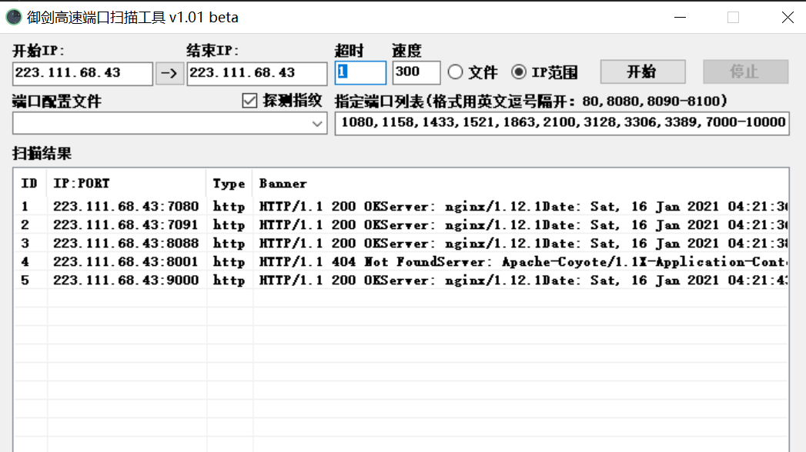
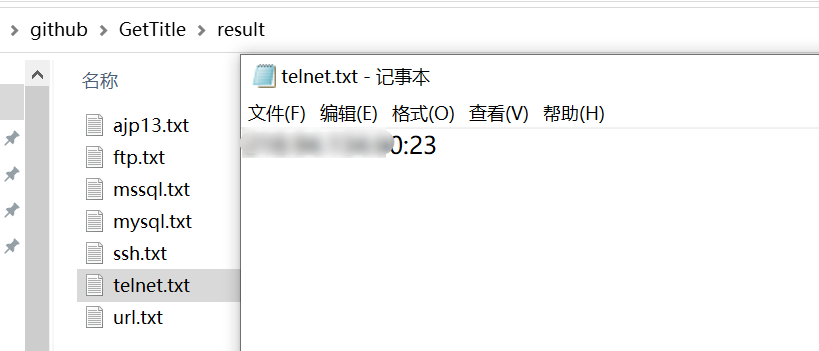
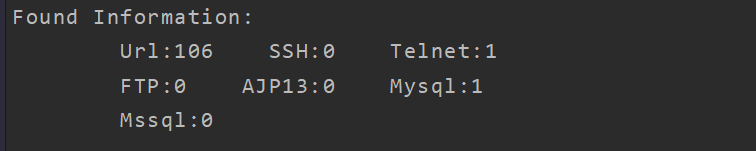
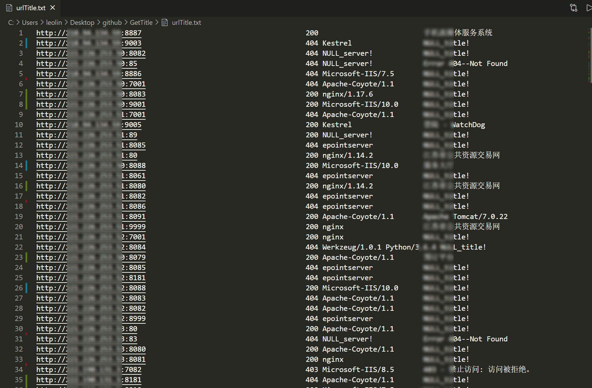

# GetTitle

### introduction：

 一个旨在渗透初期批量处理资产的工具

目前只做了从url到探测资产title的功能，后期会逐步添加nmap或御剑端口扫描结果处理、分类处理扫描出的service、资产初步处理信息呈现。最后目标是从端口扫描到xray扫描的一键化渗透工具。


### Usage:
```
Command:
  -m int
        mode choice:
        	1:parse from url list,-uF Needed;
        	2:parse from port scan file,-pF or -xF Needed
  -t int
        thread (default 15)
  -p string
        proxy setting
  -uF string
        url file name
  -pF string
        yujian port scan file
  -xF string
        nmap output xmlFileName


```
### Example:
目前代码完成了**处理御剑扫描结果**和**直接处理url list**的部分

##### (1）直接处理url：
   结果保存在urlTitle.txt中
```
	go run getTitle.go -m 1 -t 15 -uF url1.txt
```
##### (2）处理御剑导出结果：
   结果保存在urlTitle.txt中，其他端口服务结果保存在./result目录下
```
	go run getTitle.go -m 2 -t 15 -pF PortScanList1.txt
```
御剑扫描结果导出格式如下：


   其他端口服务结果：



##### 输出样例：






### ToDo：
- [x] 文本处理区别不同系统换行符
- [x] 添加访问代理
- [ ] 处理300的重定向状态码，实现重定向跟踪
- [x] 链接端口扫描结果处理的工具实现整合


