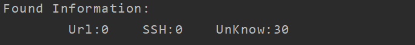
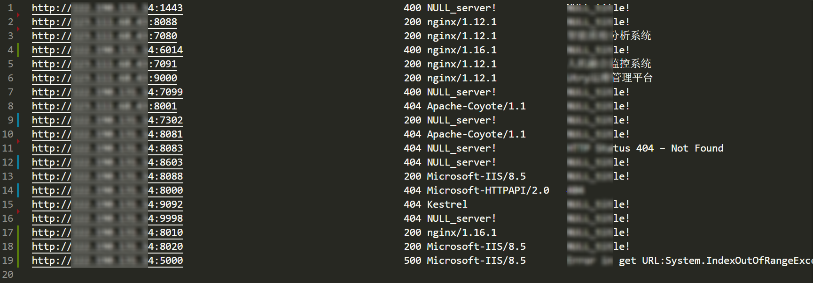

# GetTitle

### introduction：

 一个旨在渗透初期批量处理资产的工具

目前实现了处理从nmap或御剑端口扫描器导出结果，初步信息筛检，探测开放web服务并获取title的功能。

最后目标是整合从端口扫描到xray扫描的一键化渗透工具。


### Usage:
```
Command:
  -m int
        mode choice:
        	1:parse from url list,-uF Needed;
        	2:parse from port scan file,-pF or -xF Needed
  -t int
        thread (default 15)
  -p string
        proxy setting
  -uF string
        url file name
  -pF string
        yujian port scan file
  -xF string
        nmap output xmlFileName
  -T int
        request timeout seconds (default 2)
```
### Example:
##### (1）直接处理url：
   结果保存在urlTitle.txt中
```
	go run getTitle.go -m 1 -t 15 -uF url1.txt
```
##### (2）处理御剑导出结果：
   结果保存在urlTitle.txt中，其他端口服务结果保存在./Result目录下

​	目前只挑选了一部分服务，例如mysql等；

```
	go run getTitle.go -m 2 -t 15 -pF PortScanList1.txt
```
御剑扫描结果导出格式如下：


   处理后的其他端口服务结果：


##### 输出样例：


##### （3）处理Nmap导出XML文件结果：
```
	go run getTitle.go -m 2 -t 15 -xF output.xml
```

 输出结果保存在urlTitle.txt中

​	由于nmap的service比较精确，字符串难以匹配，目前只做了ssh服务资产筛选，后续会酌情添加；

**输出样例：**






### ToDo：
- [x] 文本处理区别不同系统换行符
- [x] 添加访问代理
- [x] 链接端口扫描结果处理的工具实现整合
- [ ] golang http.client参数中重定向函数的细化


